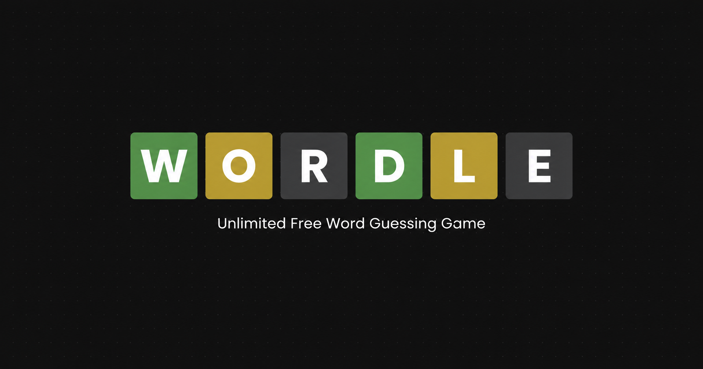

# Infinite Wordle

A premium, endless Wordle clone built with Next.js, Framer Motion, and DM Sans. Play as many words as you want, anytime.

## Features

- Endless gameplay — no daily limits, play new words back-to-back instantly
- Custom difficulty — choose between 5, 6, or 7 attempts
- Dynamic word lengths from 4 to 8 characters
- Premium design — glassmorphic UI with smooth 3D flip animations and custom typography
- Global stats — wins, streaks, and performance tracked and persisted locally
- Responsive and accessible on mobile and desktop with intuitive keyboard support
- SEO optimized with Open Graph/Twitter metadata, JSON-LD structured data, robots.txt, and sitemap.xml

## Author

**Ashutosh Swamy**

- [Portfolio](https://ashutoshswamy.in)
- [GitHub](https://github.com/ashutoshswamy)
- [LinkedIn](https://linkedin.com/in/ashutoshswamy)
- [X](https://x.com/ashutoshswamy_)
